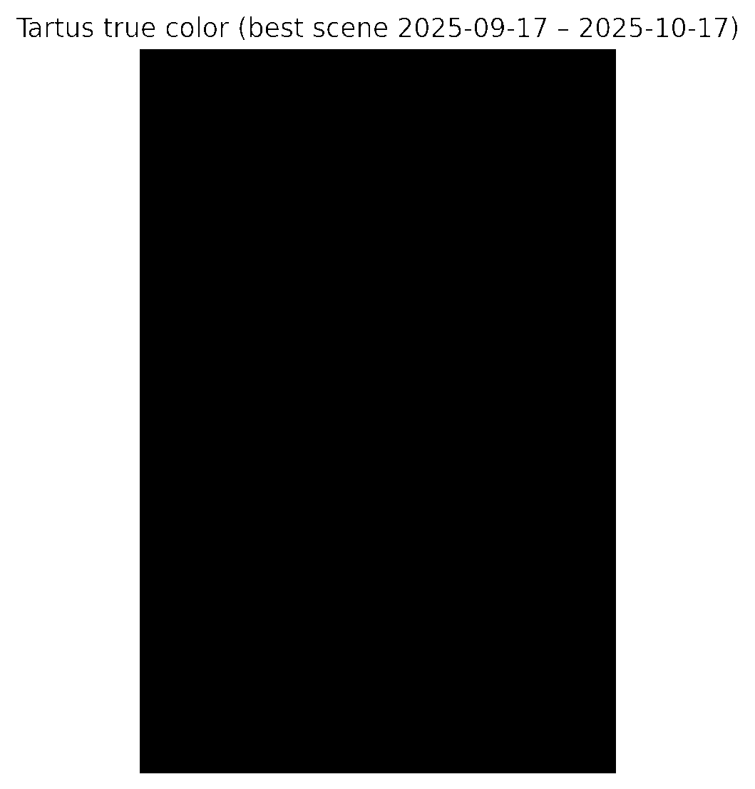

# AGROSAT – ISR Snapshot (Natanz, Tartus, Kharg Island)

Visual situational summary generated 2025‑10‑17 using Sentinel‑2 (true colour & NDVI) and Sentinel‑1 (VV amplitude/z‑score). All imagery pulled via Sentinel Hub (Client Credentials – wprowadź własne ID/Secret podczas uruchamiania).

### Dlaczego te lokalizacje?
- **Natanz (Iran)** – serce programu wzbogacania; wzmożona aktywność logistyczna lub nowe zabudowania to natychmiastowy sygnał strategiczny.
- **Tartus (Syria)** – główny port wojskowy Federacji Rosyjskiej na Morzu Śródziemnym; monitorujemy rotacje jednostek i zabezpieczenie dostaw.
- **Kharg Island (Iran)** – największy terminal eksportowy ropy; zmiany w SAR wskazują na intensywność załadunków lub sabotaż.

Dobór tych trzech punktów daje „pareto” dla regionu: nuklearne zaplecze Iranu, rosyjska projekcja siły i krwioobieg ropy. Jeden zestaw pipeline’u pokrywa więc kluczowe węzły logistyczno‑wojskowe Bliskiego Wschodu.

---

## 1. Natanz Nuclear Complex (Iran)


- **Context**: Iranian uranium enrichment site (33.72 N, 51.73 E); kluczowy ośrodek programu nuklearnego.
- **Observation (true colour)**: 30‑dniowa kompozycja z najmniejszym zachmurzeniem (gamma 0.35) – widoczne drogi serwisowe, barykady ziemne, place składowe.
- **Kluczowe elementy**: Strefa zabezpieczenia na wschód (świadczy o aktywności ochrony), pas logistyczny prowadzący do podziemi, brak świeżych wycinek roślinności.


- **NDVI median (2–17 Oct 2025)**: mean ≈ 0.07, max ≈ 0.84 – wegetacja ograniczona do starych kanałów nawodnień; brak nowych stref zielonych.
- **Wniosek NDVI**: brak przygotowań do nowych maskowań roślinnych; widoczne jedynie istniejące nasadzenia ochronne.

  


- **Sentinel‑1 VV (17/11/05 Oct 2025)**: z‑score map shows no pixels above ±2σ → brak świeżych radarowych anomalii (konwoje / nowe dachy). ΔdB w zakresie ±3 dB – stabilna scena.

**Interpretacja**: Operacje ciągłe, brak sygnałów nagłej rozbudowy. Monitorować co 6 dni dla ruchów na drogach dojazdowych.
**Warto obserwować**: kontrast między wschodnią strefą ochrony a południowym wjazdem – to tam najpierw pojawią się zwiększone transporty.

---

## 2. Tartus Naval Base (Syria)



- **Widoczne struktury**: doki, falochrony i place ładunkowe; rozciągnięcie gamma uwypukla sylwetki jednostek i magazyny paliwowe.
- **Infra**: aktywne światła portowe, ślady ruchu kołowego wzdłuż linii kolejowej.


- **NDVI mean ≈ 0.24** – utrzymane pasy zieleni (kwatery mieszkalne i strefy techniczne); stabilna eksploatacja.

  


- Sentinel‑1 (18/12/06 Oct 2025) – brak pików > 2σ; ΔdB < ±3 dB. Żadnych masywnych zmian w odbiciu radarowym (np. nowa jednostka wysokotonowa) w badanym oknie.

**Interpretacja**: Logistyka portowa w normalnych ramach; brak sygnału mobilizacji. Podwyższona baza wsparcia – trzymać alert SAR, szczególnie gdy zacznie się kumulacja tankowców.
**Warto obserwować**: zachodni basen portowy – różnice ΔdB powyżej 3 dB oznaczają nowy tonaż przy nabrzeżach.

---

## 3. Kharg Island Oil Terminal (Iran)


- **True colour**: kompleks zbiorników, doki oraz rurociągi; rozciągnięcie jasności eksponuje potencjalne obszary napraw.
- **Ślady aktywności**: świeże ślady na drogach technicznych, brak nietypowych zacienień konstrukcji.


- **NDVI mean ≈ −0.20** – zdominowane przez infrastrukturę, pojedyncze punkty zieleni przy bazach załogowych.

  


- Sentinel‑1 (18/12/06 Oct 2025): z‑score < 2σ; ΔdB ~ ±2 dB. Brak świeżych sygnałów wzmożonego tankowania / uszkodzeń.

**Interpretacja**: Ruch terminalu w normie. Zwracać uwagę na zmiany > +3 dB wzdłuż nabrzeży – sugerują cumowanie VLCC.
**Warto obserwować**: północne nabrzeże – tam najszybciej pojawiają się odchylenia z-score przy wzmożonych przeładunkach.

---

## 4. Pareto – co monitorować w pierwszej kolejności
- **Tartus SAR** – jedyny punkt o stałej obecności sprzętu ciężkiego; wzrost z‑score przy nabrzeżach = natychmiastowy alert.
- **Natanz drogi dojazdowe** – NDVI+SAR każdorazowo po burzach piaskowych; anomalie mogą wskazywać na wzmożony transport podziemny.
- **Kharg ΔdB** – monitorować podczas skoków cen ropy: różnice > +3 dB świadczą o nagłych przeładunkach.

Reszta AOI może być śledzona w interwale tygodniowym; te trzy wskaźniki decydują o 80 % potencjalnych „surge” w regionie.

---

## Jak powtórzyć analizę

1. Ustaw zmienne środowiskowe z własnym **SENTINELHUB_CLIENT_ID / _SECRET** (konto Sentinel Hub lub Copernicus Dataspace).
2. Zainstaluj zależności: `python3 -m pip install --user sentinelhub matplotlib numpy pillow`.
3. Uruchom skrypt generujący raport (np. przygotowany `generate_isr_report.py`) lub wstaw poniższy fragment w notatnik:

```python
from utils.scripts.generate_isr_report import run_isr_pipeline  # przykładowy moduł
run_isr_pipeline(aoi='natanz')
```

- **NDVI**: median composite (15‑dniowe okno, max 40 % chmur).
- **SAR**: VV amplituda, baseline 12 dni, ΔdB + z-score; próg alarmu = |z| ≥ 2.
- **Colours**: gamma 0.4 dla S2, wzmocnienie ×3 dla lepszej widoczności w pustynnych scenach.

---

**Do prezentacji**: wykorzystaj ten plik + osadzone PNG w Streamlit (`st.image(...)`, `st.json(...)`). Zestaw ready‑to‑brief: NDVI → kondycja terenu, SAR → anomalie, true colour → świadomość sytuacyjna.
