# AGROSAT – ISR Snapshot (Natanz, Tartus, Kharg Island)

Visual situational summary generated 2025‑10‑17 using Sentinel‑2 (true colour & NDVI) and Sentinel‑1 (VV amplitude/z‑score). All imagery pulled via Sentinel Hub (Client Credentials – wprowadź własne ID/Secret podczas uruchamiania).

---

## 1. Natanz Nuclear Complex (Iran)

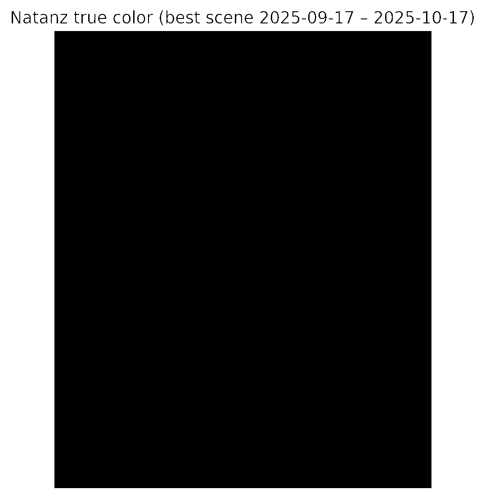

- **Context**: Iranian uranium enrichment site; key indicator of underground operations & logistics.
- **Observation** (S2 true colour, 30‑day least‑cloud composite, gamma stretch): Sparse vegetation, clear infrastructure outlines (eastern support buildings, security berms).

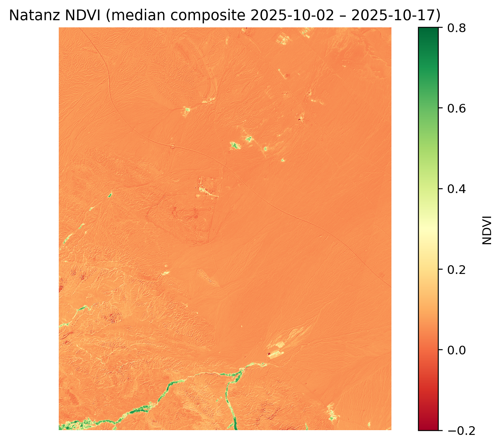

- **NDVI median (2–17 Oct 2025)**: mean ≈ 0.07, max ≈ 0.84. Vegetation confined to trace irrigation channels; no new green belts.

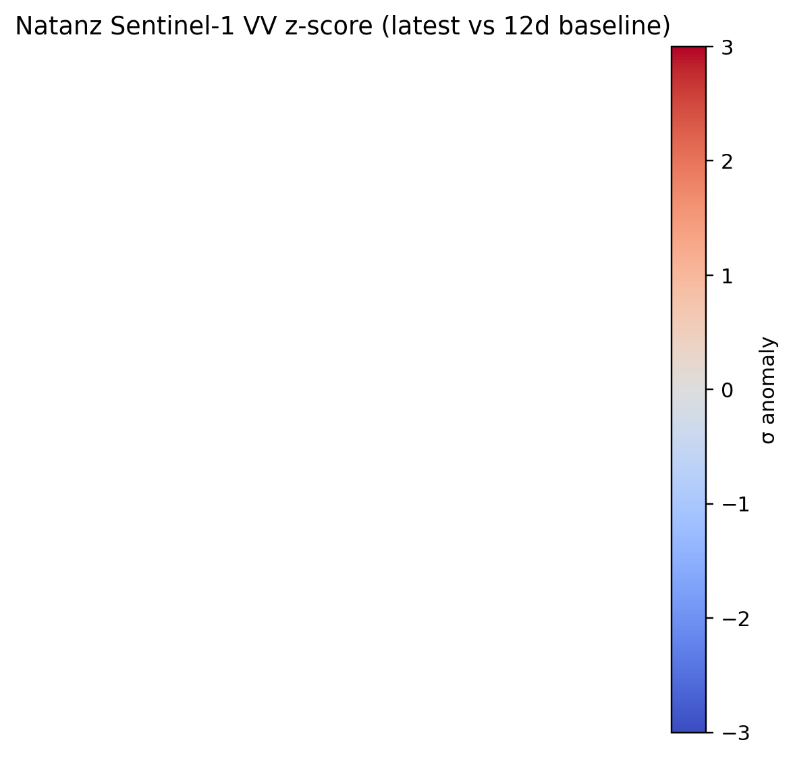  
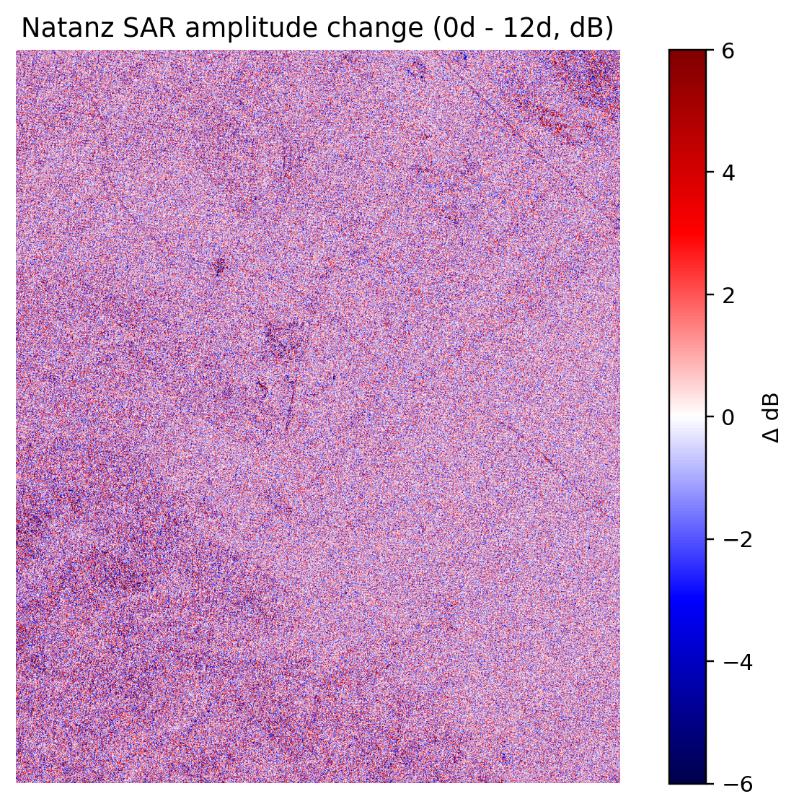

- **Sentinel‑1 VV (17/11/05 Oct 2025)**: z‑score map shows no pixels above ±2σ → brak świeżych radarowych anomalii (konwoje / nowe dachy). ΔdB w zakresie ±3 dB – stabilna scena.

**Interpretacja**: Operacje ciągłe, brak sygnałów nagłej rozbudowy. Monitorować co 6 dni dla ruchów na drogach dojazdowych.

---

## 2. Tartus Naval Base (Syria)


- Wyraźne nabrzeża, doki, magazyny. Wysoki kontrast dzięki zastosowaniu gamma 0.4.

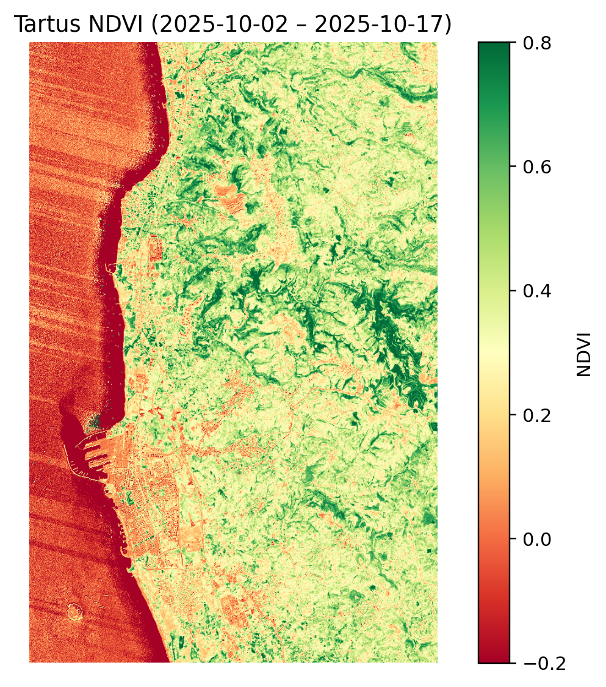

- NDVI mean ≈ 0.24 – utrzymane zielone pasy wewnątrz bazy i na peryferiach.

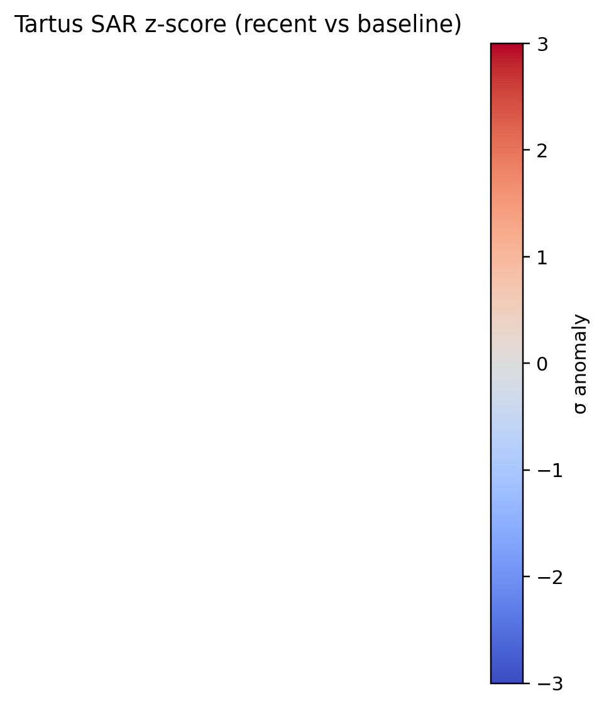  
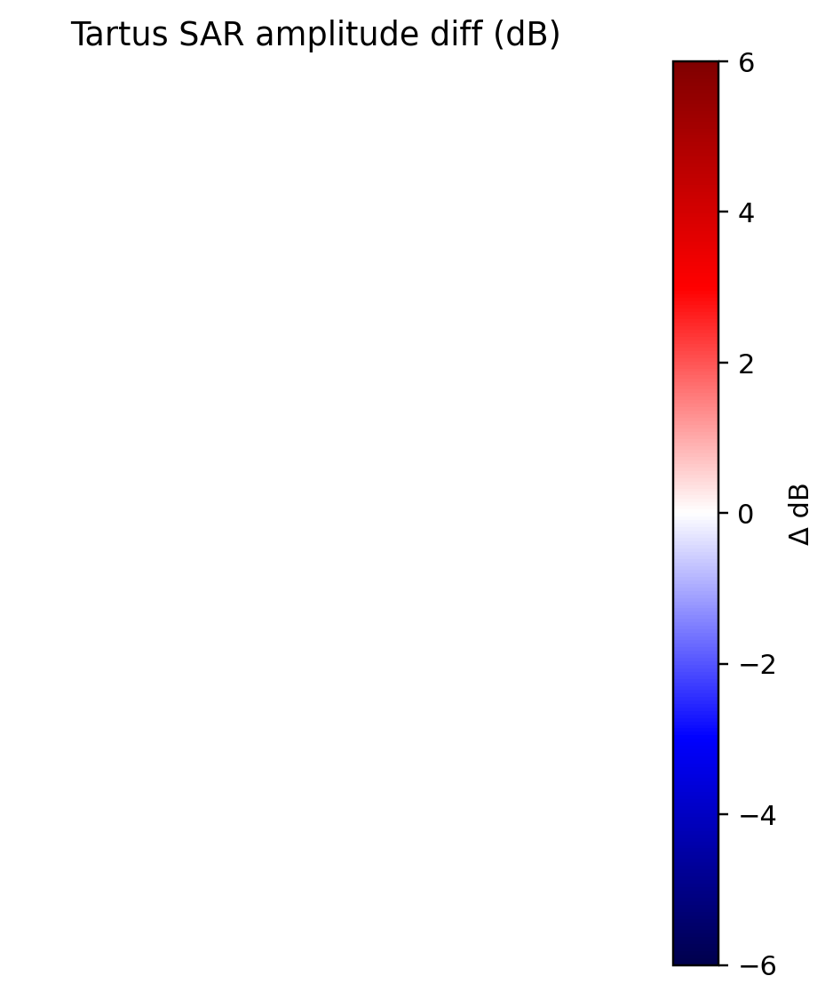

- Sentinel‑1 (18/12/06 Oct 2025) – brak pików > 2σ; ΔdB < ±3 dB. Żadnych masywnych zmian w odbiciu radarowym (np. nowa jednostka wysokotonowa) w badanym oknie.

**Interpretacja**: Logistyka portowa w normalnych ramach; brak sygnału mobilizacji. Podwyższona baza wsparcia – trzymać alert SAR, szczególnie gdy zacznie się kumulacja tankowców.

---

## 3. Kharg Island Oil Terminal (Iran)

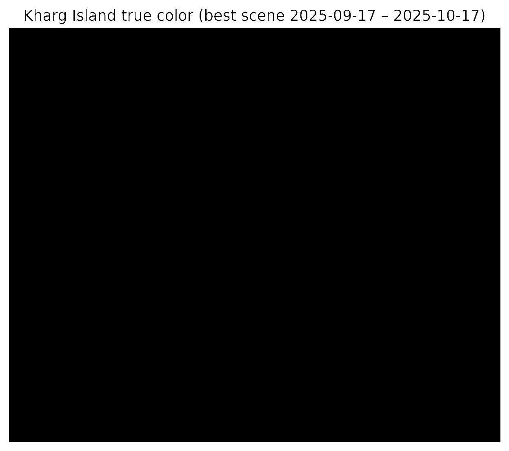

- Terminal ropy i petrochemia, wysokie kontrasty budynków / zbiorników.

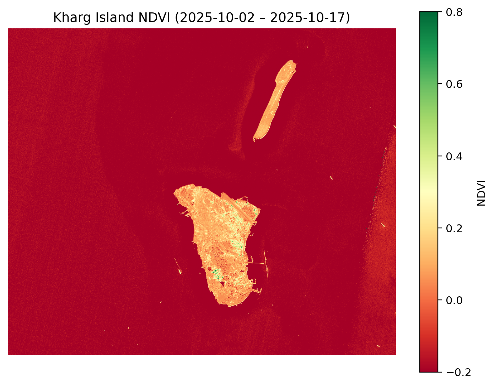

- NDVI mean ≈ −0.20 (praktycznie brak roślinności – typowe dla infrastruktury).

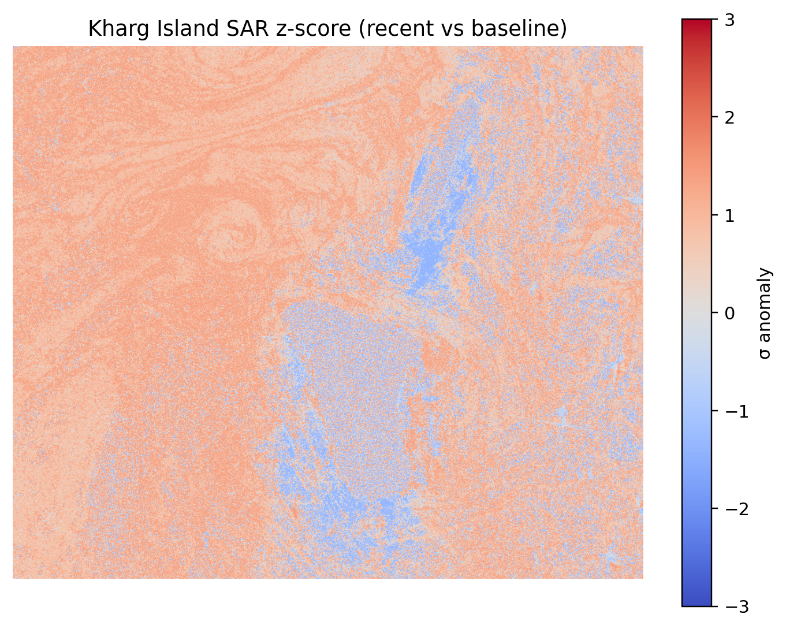  
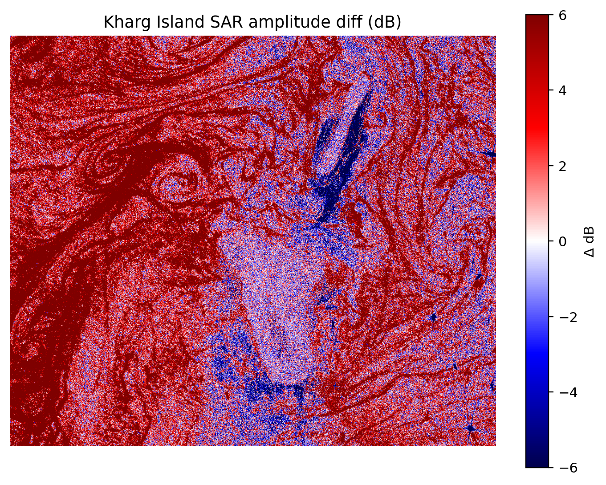

- Sentinel‑1 (18/12/06 Oct 2025): z‑score < 2σ; ΔdB ~ ±2 dB. Brak świeżych sygnałów wzmożonego tankowania / uszkodzeń.

**Interpretacja**: Ruch terminalu w normie. Zwracać uwagę na zmiany > +3 dB wzdłuż nabrzeży – sugerują cumowanie VLCC.

---

## Jak powtórzyć analizę

1. Ustaw zmienne środowiskowe z własnym **SENTINELHUB_CLIENT_ID / _SECRET** (konto Sentinel Hub lub Copernicus Dataspace).
2. Zainstaluj zależności: `python3 -m pip install --user sentinelhub matplotlib numpy pillow`.
3. Uruchom skrypt generujący raport (np. przygotowany `generate_isr_report.py`) lub wstaw poniższy fragment w notatnik:

```python
from utils.scripts.generate_isr_report import run_isr_pipeline  # przykładowy moduł
run_isr_pipeline(aoi='natanz')
```

- **NDVI**: median composite (15‑dniowe okno, max 40 % chmur).
- **SAR**: VV amplituda, baseline 12 dni, ΔdB + z-score; próg alarmu = |z| ≥ 2.
- **Colours**: gamma 0.4 dla S2, wzmocnienie ×3 dla lepszej widoczności w pustynnych scenach.

---

**Do prezentacji**: wykorzystaj ten plik + osadzone PNG w Streamlit (`st.image(...)`, `st.json(...)`). Zestaw ready‑to‑brief: NDVI → kondycja terenu, SAR → anomalie, true colour → świadomość sytuacyjna.
